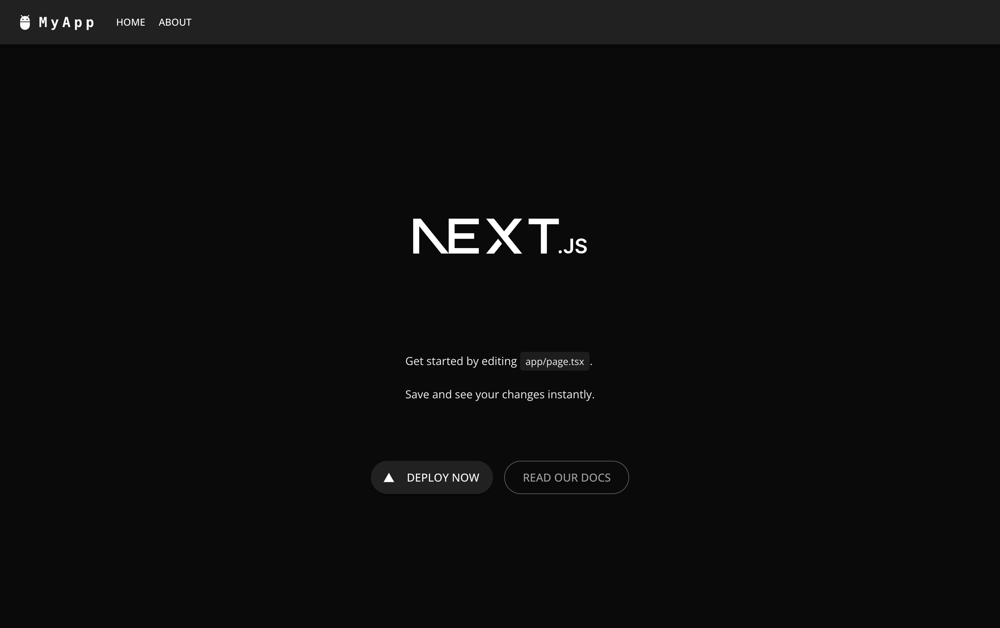

# Next + MUI + Storybook



A WIP example Next 14 application that leverages the Material UI and Storybook.

## Demo

Soon™

## Installation

Install the project and run:

```bash
  npm install
  npm run dev
```

## Features

- Utilizes Next's App Routing
- Prebuilt theme with Material UI
- Storybook for prototyping components

## Authors

- [@mikegoforth](https://www.github.com/mikegoforth)

## Acknowledgements

- This project was inspired by [Material UI - Next.js App Router example in TypeScript](https://github.com/mui/material-ui/blob/master/examples/material-ui-nextjs-ts/) by [MUI](https://github.com/mui).
- This uses [Storybook](https://storybook.js.org/) and documentation on [Storybook for Next.js](https://storybook.js.org/docs/get-started/frameworks/nextjs).
